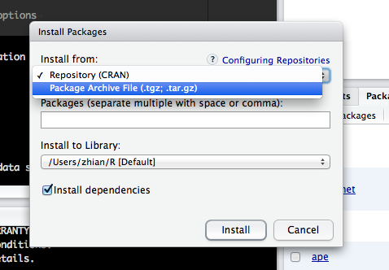

```{r,message=FALSE,echo=FALSE}
  library("knitcitations")
  library("knitr")
  cite_options(citation_format = "pandoc", max.names = 3, style = "html", hyperlink = "to.doc")
  bib <- read.bibtex("bibtexlib.bib")
  opts_chunk$set(tidy = FALSE, message = FALSE, warning = FALSE, cache = TRUE) 
  # use this to set knitr options: 
  # http://yihui.name/knitr/options #chunk_options 
```
---
title: "2: Getting ready to use R"
---

R provides a unique environment for performing population genetic analyses. You
will particularly enjoy not having to switch data formats and operating systems
to execute a series of analyses, as was the case until now. Furthermore, R
provides graphing capabilities that are ready for use in publications, with only
a little bit of extra effort. But first, let's install R, install an integrated
development environment, open R, and load R packages.

<!---

## FOR THE SPRING 2014 WORKSHOP

You must have:

1. The latest version of [R](http://www.r-project.org) **(3.1.0)**
2. [Rstudio](http://www.rstudio.com/ide/). Think of this as kind of a GUI for R.
3. The latest development version of *poppr* (1.1.0.99) (see below)

**You must download the development version of poppr** (1.1.0.99). You may do this
in several ways:

### If you do NOT have a C compiler or do not know what it is:
 1. In your R console, run the command to install the dependencies of *poppr*: `install.packages(c("adegenet", "pegas", "vegan", "ggplot2", "phangorn", "ape", "igraph"))`
 2. Download the binaries for Windows [[here]](http://grunwaldlab.cgrb.oregonstate.edu/sites/default/files/u5/poppr_1.1.0.99_24.6.14.zip) or OSX [[here]](http://grunwaldlab.cgrb.oregonstate.edu/sites/default/files/u5/poppr_1.1.0.99_24.6.14.tgz) and install using the `Tools > Install Packages...` menu command. You should see a window like this:

 

 You should make sure to choose the **Package Archive File** option and then indicate where you downloaded the package in the menubar. If you have downloaded it on your desktop, you would type `~/Desktop/poppr_1.1.0.99.tgz` (on OSX).

### If you have a working C compiler on your system

 You may do install *poppr* via the R package *devtools*:

```{r, devtools, eval=FALSE}
 install.packages("devtools")
 devtools::install_github("grunwaldlab/poppr", ref = "devel")
```
-->

Installing R
-----

1. Download and install the [R](http://www.r-project.org) statistical computing
   and graphing environment. This works cross-platform on Windows, OS X and
   Linux operating systems.

2. Download and install the [Rstudio IDE](http://www.rstudio.com/ide/) that we
   recommend as an integrated development environment.


Installing the required packages
----

The following packages are utilized in this primer:

1. [poppr](http://cran.r-project.org/web/packages/poppr/index.html)
2. [adegenet](http://cran.r-project.org/web/packages/adegenet/index.html)
4. [ggplot2](http://cran.r-project.org/web/packages/ggplot2/index.html)
5. [mmod](http://cran.r-project.org/web/packages/mmod/index.html)
3. [genetics](http://cran.r-project.org/web/packages/genetics/index.html)

Use the following script to install these packages:

```{r, eval = FALSE}
install.packages(c("poppr", "mmod", "genetics"))
```

We wrote and actively maintain *poppr* `r citep(bib["kamvar2014poppr"])` and it
is heavily relied upon in this primer. *Poppr* is an R package. You can think of
a package as a library of functions written and curated by someone in the R user
community, which you can be loaded into R for use.

Once you've installed *poppr*, you can invoke (i.e., load) it by typing or
cutting and pasting:

```{r, message=TRUE, warning=TRUE, cache=FALSE}
library("poppr")
```

This will load *poppr* and all dependent packages, such as *adegenet* and
*ade4*. You will recognize loading by the prompts written to your screen.

Congratulations. You should now be all set for using R. Loading data and
conducting your first analysis will be the topic of the next chapter. But before
we go there lets provide a few useful resources.

A quick introduction to R using Rstudio
----

Next, let's review some of the basic features and functions of R. To start R,
open the Rstudio application from your programs folder or start menu. This will
initialize your R session. To exit R, simply close the Rstudio application.

> Note that R is a case sensitive language!

Let's get comfortable with R by submitting the following command on the command
line (where R prompts you with a `>` in the lower left Rstudio window pane) that
will retrieve the current working directory on your machine:

```{r, eval=FALSE}
getwd() # this command will print the current working directory
```

> Note that the symbol '#' is used to add comments to your code and you just
> type `getwd()` after the ">".

Our primer is heavily based on the *poppr* and *adegenet* packages. To get help
on any of their functions type a question mark before the empty function call as
in:

```{r, eval=FALSE}
?mlg # open the R documentation of the function mlg()
```

To quit R you can either use the <kbd>Rstudio > Quit</kbd> pull-down menu command or
execute <kbd>⌘ + Q</kbd> (OS X) or <kbd>ctrl + Q</kbd> (PC).

Packages and getting help
----

One way that R shines above other languages for analysis is the fact that
R packages in CRAN are all documented. Help files are written in HTML and give
the user a brief overview of:

 - The purpose of a function
 - The parameters it takes
 - The output it yields
 - Some examples demonstrating its usage. 

To see all of the help topics in a package, you can simply type:

```{r, eval = FALSE}
help(package = "poppr") # Get help for a package.
help(amova)             # Get help for the amova function.
?amova                  # same as above.
??multilocus            # Search for functions that have the keyword multilocus.
```
Some packages include vignettes that can have different formats such as being
introductions, tutorials, or reference cards in PDF format. You can look at a
list of vignettes in all packages by typing:

```{r, eval=FALSE}
browseVignettes()                     # see vignettes from all packages
browseVignettes(package = 'poppr')    # see vignettes from a specific package.
```

and to look at a specific vignette you can type:

```{r, eval=FALSE}
vignette('poppr_manual')
```

Next, consider browsing the Appendix 3 on Introduction to R if you are not yet familiar with
R and Rstudio. Otherwise, you are now ready to think about formatting and
loading population genetic data into R.

References
----------

<!--->
