```{r,message=FALSE,echo=FALSE}
  html <- TRUE
  library("knitcitations")
  library("knitr")
  cite_options(citation_format = "pandoc", max.names = 3, style = "html", hyperlink = "to.doc")
  bib <- read.bibtex("bibtexlib.bib")
  opts_chunk$set(tidy = FALSE, message = FALSE, warning = FALSE, 
                 fig.width = 10, fig.height = 6, cache = TRUE)
  if (html) opts_chunk$set(out.width = "700px", dpi = 300)
  # use this to set knitr options: 
  # http://yihui.name/knitr/options #chunk_options
```

---
title: "10: Minimum Spanning Networks"
---

Minimum spanning networks (MSN) are a great way to visualize relationships among individuals in your data. In terms of clonal organisms, it can be a more powerful visualization tool than trees, especially for clonal organisms. In this chapter, we will show you how to construct and view minimum spanning networks on the command line and in an interactive viewer.

# From the command line

### Note:

This section will utilize Bruvo’s distance (Bruvo et al., 2004). Calculating Bruvo’s distance is computationally different to other distances; hence, this requires specialized functions for minimum spanning networks and bootstrapping that do not require a distance matrix:

| General function | Bruvo specific |
| ---- | ---- |
| `poppr.msn` | `bruvo.msn` |
| `aboot` | `bruvo.boot` |


### Minimum spanning network

For this section, we will use the `monpop` data set from `r citep(bib['everhart2014finescale'])`. 
See [Chapter 6](Genotypic_EvenRichDiv.html) for more details. We will be focusing
on sources of multilocus genotypes. The seasonal epidemic of the pathogen Monilinia fructicola begins with an ascospore (sexual propagule) released from a mummified peach fruit that had overwintered on the ground. It infects an emerging blossom that, in turn, asexually infects fruit, which proceed with cyclical, asexual infections. Two obvious questions are:

1. Are the major genotypes of Fruit Rot (FR) samples closely related?
2. To what degree do the Blossom Blight (BB) samples contribute to the FR?

Let's load the data:

```{r, setup}
library("poppr")
library("magrittr")
data(monpop)
splitStrata(monpop) <- ~Tree/Year/Symptom
summary(monpop)
```

We notice that tree number 26 is the only one to have been sampled for all three
years. Let's use it as an example.

```{r, setup_data}
t26 <- monpop %>% setPop(~Tree) %>% popsub("26") %>% setPop(~Year/Symptom)
t26
```

Now that we have our tree, let's calculate a MSN using Bruvo's distance 
`r citep(bib['bruvo2004simple'])`. Remember that this distance is based on a 
stepwise mutation model, so we have to first specify what kind of repeats units 
we have in our data (eg. dinucleotide = 2, trinucleotide = 3, etc.):

```{r, calculate_msn}
# Set up our repeat lengths and populations to analyze
reps <- c(CHMFc4 = 7, CHMFc5 = 2, CHMFc12 = 4, 
          SEA = 4, SED = 4, SEE = 2, SEG = 6,
          SEI = 3, SEL = 4, SEN = 2, 
          SEP = 4, SEQ = 2, SER = 4)

sub9 <- c("9_BB", "9_FR")

# Calculate the MSN
t26.9msn <- bruvo.msn(t26, replen = reps, sublist = sub9, showplot = FALSE)
```

The minimum spanning network is calculated via `bruvo.msn`. We have set the
argument `showplot = FALSE` because we want to use the more powerful function
`plot_poppr_msn` to view the MSN. I am telling it to label none of the
samples, color populations using the "cm.colors" palette and scale the size of
the nodes to $log_{1.25}$. If you want to know what other things this function
can do, simply type `help("plot_poppr_msn")`

```{r, visualize_msn, fig.width = 7, fig.height = 7}
# Visualize the network
set.seed(120)
plot_poppr_msn(t26, t26.9msn, inds = "none", palette = cm.colors, nodebase = 1.25)
```

We can see that the Blossom Blight in the tree (pink pie slices) heavily
contributed to the major groups of MLGs found in the Fruit Rot (blue pie
pieces).

> **Try it!** See if you can produce similar graphs with the 2010 and 2011
> populations.


# Interactive viewer


That seems like a lot of work to create a minimum spanning network, right? If
you look at the all of the arguments for `plot\_poppr\_msn`, there are a whole
lot of them:

```{r, plot_poppr_msn_args}
args(plot_poppr_msn)
```

This is overwhelming even for people who are comfortable with R. Since this
function is designed to provide a visualization after calculation, it only makes
sense to have an interactive, visual interface. This interface is called
`imsn()`. Let's try to recreate the plot above using the `imsn()` function. Note
that the function takes no arguments.

```{r, imsn, eval = FALSE}
imsn()
```

(Note: you probably will not see the whole screen like this, but you can still
scroll down)

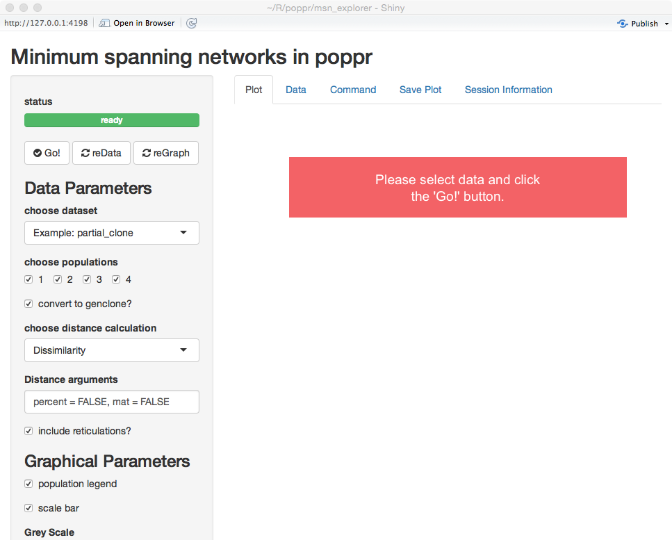

We can see that there are five tabs and a sidebar. For now, we'll explain what
is on the sidebar. 


The first thing you see is a green bar that says "ready".
This means that there are no processes going on in the background and that it's
ready for input. Below that are three buttons, **Go!**, **reData**, and
**reGraph**. These buttons are how you will tell the program that you are ready
for it to make your graph.

## Parameters (sidebar)

Notice that there are two main sections, **Data Parameters** and **Graphical
Parameters**.

### Data Parameters

As you can expect, these options represent parameters that will manipulate your
data. Changing any of these choices means that the distance matrix will be
recalculated. When you modify things in this section and are satisfied with your
choices, you can use the **reData** button to update the graph. You see here
four choices presented:

1. choose dataset - This dropdown menu allows you to choose your data set.    
   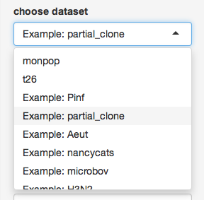
2. choose populations - this will change based on your data set, but it allows
   you to select different populations with which to subset your data     
   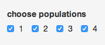
3. convert to genclone? - If your data is in genind format, you can convert it
   to genclone (minimally reduces time for clonal organisms)     
   
3. choose distance calculation - The distance measure to calculate from your
   data (notice that there's "Custom" at the bottom)     
   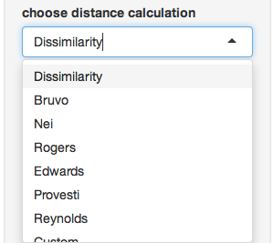
4. Distance arguments - every distance has different arguments, this is where
   you can modify them     
   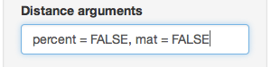
6. include reticulations? - This is an important parameter that will include
   reticulations in the minimum spanning network. We'll explore this with the
   `Pram` data set later.     
   

### Graphical Parameters

The parameters listed here allow you to modify the look and feel of the graph
without having to recalculate the data. We encourage the user to play around
with these to see what the different sliders and buttons do. 

## Output (tabs)

### Plot

This is the tab you see immediately. It has nothing in it because we haven't 
told imsn to do anything. Let's hit **Go!** with our default parameters and 
see what happens.


We now have a minimum spanning network of partial clone based a dissimilarity
distance ("diss.dist") where the distance is represented as counts of dissimilar alleles. 

### Data

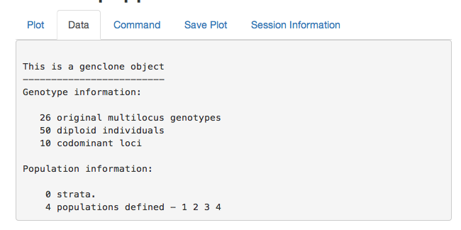

This is the output of your data set. You can use this to confirm that your data
is what you expect.

### Command

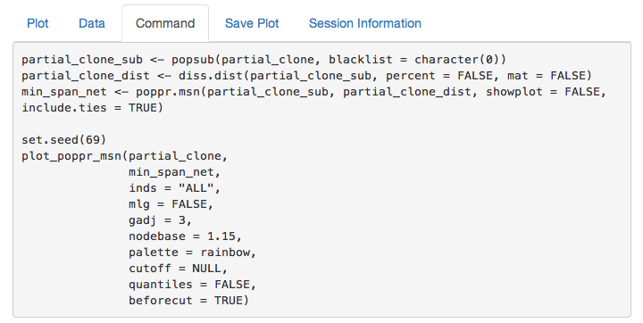

If you copy and paste this command into your R console, you can recreate the
minimum spanning network. This is important to make sure that your figure is
reproducible.

```{r, partial_clone_reproduce, fig.width = 7, fig.height = 7}
data("partial_clone") # Don't forget to load the data
partial_clone_sub <- popsub(partial_clone, blacklist = character(0))
partial_clone_dist <- diss.dist(partial_clone_sub, percent = FALSE, mat = FALSE)
min_span_net <- poppr.msn(partial_clone_sub, partial_clone_dist, showplot = FALSE, include.ties = TRUE)

set.seed(69)
plot_poppr_msn(partial_clone,
	       min_span_net,
	       inds = "ALL",
	       mlg = FALSE,
	       gadj = 3,
	       nodebase = 1.15,
	       palette = rainbow,
	       cutoff = NULL,
	       quantiles = FALSE,
	       beforecut = TRUE)
```

### Save Plot


This allows you to save the plot to your computer in pdf or png format.

### Session Information 

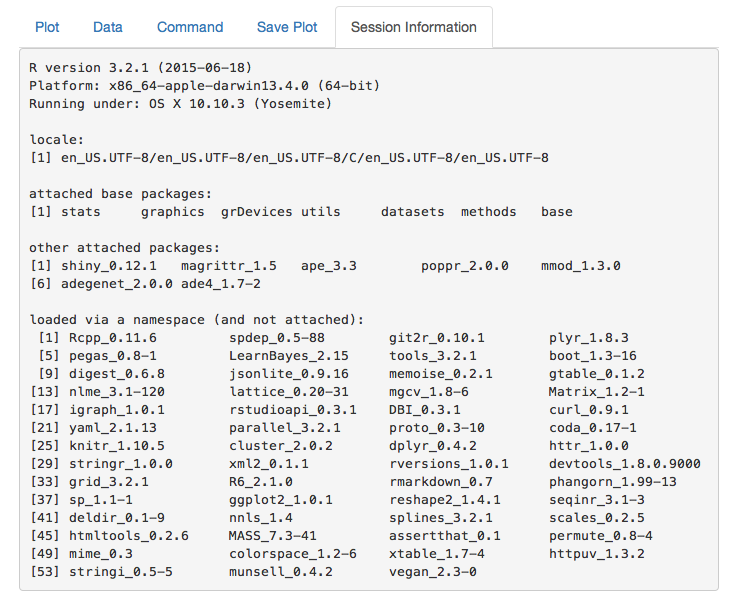

This shows you what package versions were used to create the graph.


## Re-creating MSNs

We will now recreate the minimum spanning network that was displayed for the 
monpop data set. 

First, choose the `t26` data set that we defined above:

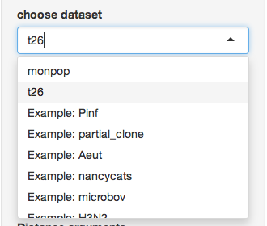

Next, make sure you only select the "9\_BB" and "9\_FR" populations.

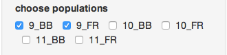

Now, Select "Bruvo's Distance":

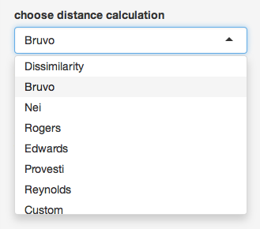

Notice how the options have now changed. This is because bruvo's distance is a
special distance that is parametric. Don't worry about the model for missing data, but in the SSR repeat lengths section, type "reps" (we defined this earlier):

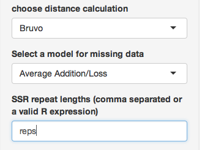

```{r}
reps # our previous definition of "reps"
```

Now, modify the following graphical parameters:

- seed: **120**
- Node Size Scale: **1.25** (this is the option `nodebase`)
- Labels: **none** (this is the option `inds`)
- Palette: **cm.colors**

Once everthing is set, hit **reData** and the graph will reset just like this:

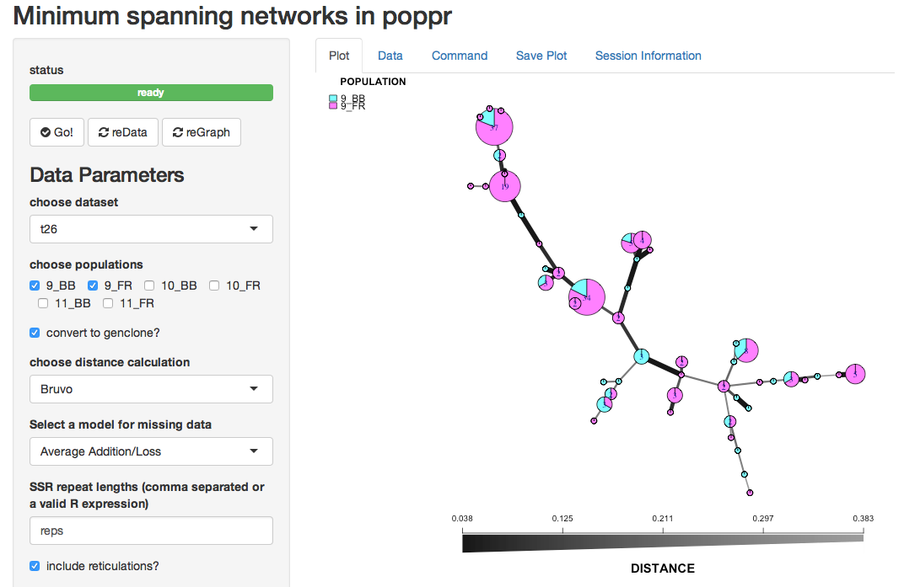

## Your turn (Data: *Phytophthora ramorum*)

Now we will use data from `r citet(bib["kamvar2015spatial"])`. This is the
Sudden Oak Death pathogen collected from forests in Curry County Oregon and 
Nurseries in California and Oregon `r citep(bib["goss2009population"])`. We will
use this data set to see why reticulations are important for highly clonal
organisms.

### Load the data

```{r, pramorum}
data("Pram")
Pram
```

This data has a few things in the "other" slot that we need. First is the repeat
lengths called "REPLEN" and the other is a vector of hexadecimal colors for each
population called "comparePal". 

```{r, pramother}
other(Pram)$REPLEN
other(Pram)$comparePal
```

We will use these to create the following minimum spanning network:

```{r, prammsn, echo = FALSE, fig.width = 10, fig.height = 10}
Pram_sub <- popsub(Pram, blacklist = character(0))
min_span_net <- bruvo.msn(Pram_sub, replen = other(Pram)$REPLEN, add = TRUE, loss = TRUE, showplot = FALSE, include.ties = TRUE)
set.seed(78)
plot_poppr_msn(Pram,
	       min_span_net,
	       inds = "none",
	       mlg = FALSE,
	       gadj = 9,
	       nodebase = 1.95,
	       palette = function(x) other(Pram)$comparePal,
	       cutoff = NULL,
	       quantiles = FALSE,
	       beforecut = TRUE)
```

Here are the parameters you should use:

- Data:
    - Dataset: **Pram**
    - Distance: **Bruvo**
    - SSR Repeat Lengths: **`other(Pram)$REPLEN`**
- Graphical:
    - Grey Scale: **9**
    - Node Size Scale: **1.95**
    - Random Seed: **78**
    - Labels: **none**
    - Palette: **Custom: `function(x) other(Pram)$comparePal`**


# References