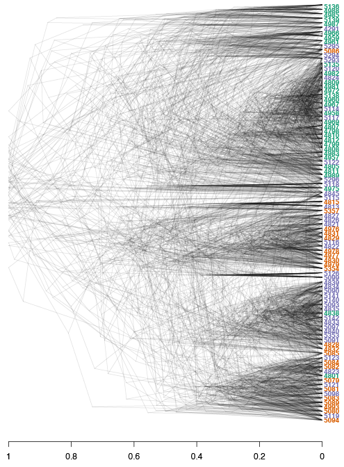

```{r,message=FALSE,echo=FALSE}
#  html <- TRUE
#  library("knitcitations")
#  library("knitr")
  knitcitations::cite_options(citation_format = "pandoc", max.names = 3, style = "html", hyperlink = "to.doc")
  bib <- knitcitations::read.bibtex("bibtexlib.bib")
#  if (html) opts_chunk$set(out.width = "700px", dpi = 300)
```


```{r setup, include=FALSE}
knitr::opts_chunk$set(tidy = FALSE, message = FALSE, warning = FALSE)
knitr::opts_chunk$set(echo = TRUE)
knitr::opts_chunk$set(fig.align = 'center')
knitr::opts_chunk$set(fig.width = 12)
knitr::opts_chunk$set(fig.height = 10)
library("knitcitations")
```


## Introduction


This tutorial focuses on large SNP data sets such as those obtained from **genotyping-by-sequencing (GBS)** for population genetic analysis in R.
GBS is one of several techniques used to genotype populations using high throughput sequencing (HTS).
In GBS, the genome is reduced in representation by using restriction enzymes, and then sequencing these products using HTS. 
For more information on these techniques we recommend reading @Baird:2008cq, @ROWE:2011ks, or @Poland:2012hs.

```{r child = 'data_gbs.Rmd'}
```

To obtain variant calls in form of VCF data, the FASTQ reads from HTS were mapped to the reference genome of *P. rubi* (Tabima et al., in prep) using `bowtie2` [@langmead2012fast]. 
Variants were called using the `GATK HaplotypeCaller` [@mckenna2010genome]. 
This data was further filtered in *vcfR* using read depths (DP) and mapping qualities (MQ). 
Data was filtered as follows:

- A minimum DP of 5x.
- Variants in the top 5% of the DP distribution were removed.
- Only variants with a MQ greater than 40 were retained.
- Variants with more than 60% missing data were removed.

In addition to the VCF data, we have included the file `population_data.gbs.txt`, a tab-delimited text file that includes the name of the sample, country of origin, and the population from where it was sampled. 
The file is available for download at: [`population_data.gbs.txt`](population_data.gbs.txt).
This link will likely open the data in a browser. 
Save the data onto your hard-drive as an ASCII text file with the same name.

## Opening and examining the vcf file

Let's first load the libraries needed for analysis:

```{r, message=FALSE}
library(vcfR)
library(poppr)
library(ape)
library(RColorBrewer)
```

Make sure you are in the right folder with the downloaded files available. 
Some of these packages will print a message when they are loaded.
Here we suppressed this information.
When you load these packages, you may see more output than presented here.

Next, let's open the VCF file using *vcfR* and check that we have 94 samples and 615 SNPs:

```{r, results='hide'}
rubi.VCF <- read.vcfR("prubi_gbs.vcf.gz")
```

Once we've loaded the data into R, we can validate it by entering our object's name in the console:

```{r}
rubi.VCF
```

VCF data does not typically include any sort of population information.
We have to load this data separately from the text-delimited file we downloaded above that includes the ID of samples and the state where the samples were obtained from. 
Let's load the `population_data.gbs.txt` file into memory by using the `read.table()` function:

```{r}
pop.data <- read.table("population_data.gbs.txt", sep = "\t", header = TRUE)
```

We can now check that all the samples in the VCF and the population data frame are included: 

```{r}
all(colnames(rubi.VCF@gt)[-1] == pop.data$AccessID)
```

Remember, the first column for the *vcfR* object's GT slot is a `FORMAT` column, hence we removed it from the name comparison step (i.e., by removing the first element in the column names vector, the `FORMAT` column name).
If we keep the `FORMAT` column name we will not be able to compare between the names of the samples in the *vcfR* object. 
All of the 94 samples in the population data frame loaded in the *vcfR* object are in the same order.

## Converting the dataset to a genlight object

The next step is to convert the data set into an object that is usable by `poppr`, `adegenet`, or any of the other population genetics packages in R.
The *vcfR* package contains multiple functions to convert data into other formats (see the `converting_data` vignette of *vcfR*): `vignette('converting_data')`. 
For our particular purpose we want to convert the *vcfR* object into a `genlight` object. 
We can use the `vcfR2genlight` function for this:

```{r, warning=TRUE}
gl.rubi <- vcfR2genlight(rubi.VCF)
```

A warning is shown while transforming the object, telling us that there are seven loci with more than two alleles. 
Many of the functions we will be using in these tutorials have been written under the assumption of a bi-allelic model. 
This bi-allelic model restricts all loci to only two alleles in order to simplify some calculations.
The `genlight` object supports only loci with no more than two alleles.
The `vcfR2genlight` function subsets the data to filter loci that are not bi-allelic, returning an object that contains only loci with two alleles.
The warning is to make sure we are aware that this action has taken place.

Additionally, we are required to specify the ploidy of the organism in order to calculate some population genetic metrics. 
*P. rubi* is a diploid organism, so we will specify a ploidy of two. 
All `genlight` objects have ploidy slots, in which the user can specify the ploidy of each individual sample, or once for the entire population. 
We can assume that every sample of *P. rubi* is diploid and we will specify a ploidy of 2 for the entire population.
Note that while a `genlight` object can support individuals of different ploidy, within each individual all loci must be of the same ploidy.

```{r}
ploidy(gl.rubi) <- 2
```

Our biological question requires predetermined populations.
We can add them to the genlight object as part of the `pop` (population) slot.
In order to specify the population, we added the `State` column from our `pop.data` data frame to the `pop` slot of our `genlight` object:

```{r}
pop(gl.rubi) <- pop.data$State
```

We now end up with a `genlight` object of filtered VCF data:

```{r}
gl.rubi
```

Next, let’s get started with our first analyses.

## Population genetic analyses for GBS data

```{r child = 'genlight_dist.Rmd'}
```

### Distance tree

Let's start our analysis by building a genetic distance tree that represents the genetic relatedness of the samples.
The similarity between samples and groups of samples is represented by the branch length.
In most trees, the branch length is represented by the number of substitutions per site for a cluster or a sample.
When samples are very similar, they are grouped by short branches.
The longer the branch, the higher the number of substitutions and the higher the genetic distance is between samples or clusters.

For this tutorial, we will build a distance tree to obtain an initial assessment of the population structure of the *P. rubi* samples in the western US.
We will reconstruct a distance tree based on the UPGMA algorithm, with 100 bootstrap replicates to assess branch support:

```{r}
tree <- aboot(gl.rubi, tree = "upgma", distance = bitwise.dist, sample = 100, showtree = F, cutoff = 50, quiet = T)
```

Next, we will color the tips of the tree based on the population of origin of the samples, and draw conclusions from what we observe in the tree:


```{r}
cols <- brewer.pal(n = nPop(gl.rubi), name = "Dark2")
plot.phylo(tree, cex = 0.8, font = 2, adj = 0, tip.color =  cols[pop(gl.rubi)])
nodelabels(tree$node.label, adj = c(1.3, -0.5), frame = "n", cex = 0.8,font = 3, xpd = TRUE)
#legend(35,10,c("CA","OR","WA"),cols, border = FALSE, bty = "n")
legend('topleft', legend = c("CA","OR","WA"), fill = cols, border = FALSE, bty = "n", cex = 2)
axis(side = 1)
title(xlab = "Genetic distance (proportion of loci that are different)")
```

We observe that samples do not cluster exclusively by region (e.g., CA, OR and WA). Instead, we observe a cluster with mainly CA samples (Green), but also containing a few WA (purple) and two OR (red) samples. The second, lower cluster contains predominantly samples for OR (red) and WA (purple). 

### Minimum spanning networks

Another useful independent analysis to visualize population structure is a minimum spanning network (MSN).
MSN clusters multilocus genotypes (MLG) by genetic distances between them.
Each MLG is a node, and the genetic distance is represented by the edges.
In high throughput sequencing studies, where marker density is high, each sample typically consists of a unique genotype.

> QUESTION: Do we show a reticulated MSN? OR a MST?

The nodes will be connected by the minimum distance between samples. 
This allows for **reticulations** (e.g., a network connecting nodes with identical genetic distances; contrast this with a tree where pairwise nodes are only connected to one other node with the shortest distances, even if several nodes share the same minimum genetic distance).

To reconstruct a MSN we require a `genlight` object and a distance matrix that represents the genetic distance between samples. 
To calculate this distance we will use the `bitwise.dist()` function from `poppr`. 
The `bitwise.dist()` function is a fast method to calculate the number of allelic differences between two samples:

```{r}
library(igraph)

rubi.dist <- bitwise.dist(gl.rubi)
rubi.msn <- poppr.msn(gl.rubi, rubi.dist, showplot = FALSE, include.ties = T)

node.size <- rep(2, times = nInd(gl.rubi))
names(node.size) <- indNames(gl.rubi)
vertex.attributes(rubi.msn$graph)$size <- node.size

set.seed(9)
plot_poppr_msn(gl.rubi, rubi.msn , palette = brewer.pal(n = nPop(gl.rubi), name = "Dark2"), gadj = 70)
```


Note that we have used the command `set.seed(9)` to set a random number seed.
Because there is some stochasticity in the presentation of a MSN, this is required to reproduce the exact same plot.
In practice, you should explore using different seeds to obtain different representations of the same data.

The plot is similar to the tree we rendered above and shows that the populations are not fully differentiated geographically.
There are two main groups in the plot, one that clusters the OR samples with some WA samples (upper left), and a second that clusters the CA samples with some WA samples (lower right). 
This provides additional evidence for the two clusters observed in the genetic distance tree.
Next, we perform a principal components analysis.

### Principal components analysis

A principal components analysis (PCA) converts the observed SNP data into a set of values of linearly uncorrelated variables called `principal components` that summarize the variation between samples. 
We can perform a PCA on our genlight object by using the `glPCA` function. 

```{r, fig.width = 5,fig.height = 5}
rubi.pca <- glPca(gl.rubi, nf = 3)
barplot(100*rubi.pca$eig/sum(rubi.pca$eig), col = heat.colors(50), main="PCA Eigenvalues")
title(ylab="Proportion of variance\nexplained", line = 2)
title(xlab="Eigenvalues", line = 1)

```

The barplot indicates that we will need to only retain the first 3 PCAs, which cumulatively explain   explain ```r 100 * round(sum(rubi.pca$eig[1:3]/sum(rubi.pca$eig)), digits = 5)``` percent of the variance of the data.

To view the results of the PCA we can use the package `ggplot2`. 
We  need to convert the data frame that contains the principal components (`rubi.pca$scores`) into the new object `rubi.pca.scores`.
In addition, we will add the population values as a new column in our `rubi.pca.scores` object, in order to be able to color samples by population.

`ggplot2` will plot the PCA, color the samples by population, and create ellipses that include 95% of the data for each the population:

```{r, fig.width = 6,fig.height = 6}

rubi.pca.scores <- as.data.frame(rubi.pca$scores)
rubi.pca.scores$pop <- pop(gl.rubi)

library(ggplot2)
set.seed(9)
p <- ggplot(rubi.pca.scores, aes(x=PC1, y=PC2, colour=pop)) 
p <- p + geom_point(size=2)
p <- p + stat_ellipse(level = 0.95, size = 1)
p <- p + scale_color_manual(values = cols) 
p <- p + geom_hline(yintercept = 0) 
p <- p + geom_vline(xintercept = 0) 
p <- p + theme_bw()

p
```

The PCA produces a pattern similar our previous results. We observe that PC1 distinguishes samples from WA and OR, (right) from a cluster predominantly made up of CA and WA samples (left). The CA samples form a tight cluster with a narrow ellipse in green.

We can further explore population assignments using a discriminant analysis of principal components (DAPC).

### DAPC

The DAPC is a multivariate statistical approach that uses populations defined *a priori* to maximize the variance among populations in the sample by partitioning it into between-population and within-population components.
DAPC thus maximizes the discrimination between groups. 
DAPC is explained in depth in the [DAPC chapter on Part II of this tutorial](DAPC.html) and in the [DAPC adegenet vignette](http://adegenet.r-forge.r-project.org/files/tutorial-dapc.pdf).

DAPC requires a genlight object with populations defined *a priori*.
We already have this `genlight` object from the above steps.
Usually, we use the number of principal components and discriminant axes that maximize the variance between populations; but our objective here is to calculate the population assignments based on the results of the PCA.
We will use the same parameters as in the PCA to make the results comparable between both methods. These parameters (`n.pca=3` and `n.da=2`) will be used to reconstruct the DAPC, obtain the assignment of the samples to each population, and suggest admixture between geographical states in the western USA.

```{r, fig.width=6, fig.height=6}
pnw.dapc <- dapc(gl.rubi, n.pca = 3, n.da = 2)
```

To confirm that the DAPC is similar to the PCA we can plot the data in a scatter plot.

```{r, fig.width=6, fig.height=6}
scatter(pnw.dapc, col = cols, cex = 2, legend = TRUE, clabel = F, posi.leg = "bottomleft", scree.pca = TRUE,
        posi.pca = "topleft", cleg = 0.75)
```


We see that the results of the PCA and  DAPC are very similar.
The DAPC object we created includes the population membership probability for each sample to each of the predetermined populations. 
To visualize the posterior assignments of each sample, we use a composite stacked bar plot (`compoplot`).
A `compoplot` illustrates the probability of population membership on the y-axis.
Each sample is a bin on the x-axis, and the assigned probability of population membership is shown as a stacked bar chart with clusters or populations shown in color.


```{r, fig.height=4}
#compoplot(pnw.dapc,col = function(x) cols, posi = 'top')
compoplot(pnw.dapc,col = cols, posi = 'top')
```


```{r, fig.height=4, include=F}
barplot(t(pnw.dapc$posterior), col = cols, las = 3, space = 0, border = NA, cex.names = 0.6)
title(ylab = "Membership probability")
```


These plots are hard to interpret and we will thus separate the samples by population.  
`ggplot2` can be used to reconstruct these plots, but we need to convert the data into a `ggplot2` friendly object. 
We will extract the DAPC calculated population membership assignments (`pnw.dapc$posterior`) into a new data frame (`dapc.results`), include the original population assignment as a new column in the data frame (`dapc.results$pop`), and add a column that includes the sample names (`dapc.results$indNames`).

```{r}
dapc.results <- as.data.frame(pnw.dapc$posterior)
dapc.results$pop <- pop(gl.rubi)
dapc.results$indNames <- rownames(dapc.results)
```

`ggplot2` has specific requirements for the structure of the data frame format, as it requires each observation in rows, and all different values of these observations in columns (i.e., a long format data frame). 
To transform the data frame we use the function `melt` from the package `reshape2`.
`melt` reorganizes the data frame into the required data frame format, where each membership probability observation for a given population is a row with the sample name, original population, and assigned population as columns.

```{r}
library(reshape2)
dapc.results <- melt(dapc.results)
```

Ignore the prompt for now. 
Then, we rename the columns into more familiar terms:

```{r}
colnames(dapc.results) <- c("Original_Pop","Sample","Assigned_Pop","Posterior_membership_probability")
```

`ggplot2` will plot the `dapc.results` data frame we reorganized using `melt`, using the samples on the X-axis and membership probabilities on the Y-axis. 
The fill color will indicate the original population assignments.
Each facet represents the original population assignment for each sample:

```{r, fig.height=4}
p <- ggplot(dapc.results, aes(x=Sample, y=Posterior_membership_probability, fill=Assigned_Pop))
p <- p + geom_bar(stat='identity') 
p <- p + scale_fill_manual(values = cols) 
p <- p + facet_grid(~Original_Pop, scales = "free")
p <- p + theme(axis.text.x = element_text(angle = 90, hjust = 1, size = 8))
p
```


This bar plot shows us a more organized perspective of our data set by contrasting the population membership probability assignments against their original populations.


In general, the composite plot shows that all western states of the USA exhibit admixture with other states, with WA showing the most admixture.


## Subsetting a vcfR object to 200 random variants

One of the main limitations encountered when performing a population genetic analysis using large SNP data sets is the size of the data set. 
Large datasets require large amounts of computing resources, presenting a challenge to individuals who are not familiar with managing their computing resources.
These large data sets are becoming very common thanks to the current developments on genomics and computational biology, where instead on performing analyses on one or a few loci current analyses focus in entire genomes of large populations.

GBS data sets are good examples of large data sets used in population genetics. 
The large number of samples, and the high number of variants obtained, can generate gigabytes of data that are difficult to analyse with a desktop computer. 
Many of the variants obtained from GBS analyses are removed via filtering (for a deeper explanation of filtering genomic variant data review the [quality control](qc.html) chapter of this workshop).
Nonetheless, these filtered data sets may have hundreds to thousands of variants, making their analysis very tedious for the average user.

One way of solving the issues of dealing with large genomic data sets is to subset the data set to smaller groups of random variants across the genome. 
Multiple subsets of a data set can be analysed in order to determine if the different subsets reveal similar overall results.
These independent analyses will provide support to the results, while reducing the effective computational time of the analysis.

We will illustrate the process of subsetting datasets using the *P. rubi* GBS data.
As a reminder, this dataset has 138 samples spanning 615 variants across the genome. 
The number of variants in this analysis does not reflect a real large data set, but we will use it as it will allow us to compare the results of the subsets against the total analysis.
This comparison will demonstrate that subsets of large data sets can provide information that is similar to the total data set while reducing the computational intensity of the calculations.

In this example we will show how to subset the data to 200 random variants across the genome. 
We will use the `rubi.VCF` object we created at the beginning of this tutorial.
To subset, we use square brackets to select portions of an object we would like to retain.
The square brackets represent the values to be subset from the original data set, for example: if we have a vector with the four first letters of the alphabet ("A","B","C","D"), and we want to subset only the first two occurrences we can do this:

```{r}
alphabet <- c("A","B","C","D")
alphabet[c(1,2)]
```

We see that when we use the `alphabet[c(1,2)]` we are calling the first two occurrences of the vector of interest. 
We can do something very similar with the `vcfR` objects from the `vcfR` package. 
Lets say we are interested only in the first 10 variants of our `rubi.VCF`, we can do something similar:

```{r}
rubi.VCF
rubi.VCF[c(1:10),]
```

We can see that the second object only has 10 variants. 
If we look at the summary in detail, we observe that the original sample has 312 chromosomes/scaffolds, 615 variants and a size of 2.9 Mb. 
The subset object, on the other hand, only has 4 chromosomes/scaffolds, 10 variants and a size of 0.9 Mb.
Both objects have the same number of samples. 
This is a good example of how to subset a `vcfR` object.
However, we want to obtain a subset of 200 **random** variants. 
If we do `rubi.VCF[c(1:200)]` we will only obtain the first 200 variants.
These 200 variants will always be the same, and we will have no real replication to determine the strength of our approach.

One way to solve this problem is to generate a random string of 200 numbers that range from 1 to the total number of variants of the object. 
The R statistical environment has the function `sample()`.
The function `sample()` generates a random vector of elements (i.e. numbers or elements from a vector).
We can use `sample()` to generate the random vector of 200 numbers that range from 1 to the total number of variants of the object.
The total number of variants in a `vcfR` object is equivalent to the number of rows in the vcfR object.
We will use the `nrow()` method for our `vcfR` object to obtain the maximum range of values to subset our data set:

```{r}
subset.1 <- sample(size = 200, x= c(1:nrow(rubi.VCF)))
subset.2 <- sample(size = 200, x= c(1:nrow(rubi.VCF)))
```

We have to check that the subsets are not identical. 
We can confirm this by using the function `identical()`.

```{r}
identical(subset.1, subset.2)
```

We can see that the vectors have different numbers. 
The results from `identical()` do not mean that every number in the vector is different.
It just means that some of the values in the vectors are different, but each vector can also share some numbers with the other vector.

Now we know how to generate a vector of 200 random numbers from 1 to the length of the `vcfR` object. 
We will use these vectors to subset the `rubi.VCF` object.
To subset the `vcfR` object we execute code very similar to the one shown in the subset example.
The main difference is that now we can use the `subset.1` and `subset.2` objects as the subset indices:

```{r}
rubi.VCF.sub1 <- rubi.VCF[subset.1,]
rubi.VCF.sub2 <- rubi.VCF[subset.2,]

rubi.VCF.sub1
rubi.VCF.sub2
```

When the two `rubi.VCF.sub` objects are compared we can see that the number of variants (200) and the number of samples (94) are identical.
This indicates that the subset was performed correctly.
Observe that the chromosome number and percentage of missing data are different.
These different numbers show that each subset has selected different variants.

Now we can generate subsets of random variants. 
We will extend the subset example by creating 50 subsets of 200 variants each, then we will then reconstruct a UPGMA distance tree per subset and overlay all of the reconstructed trees.
This tree overlay will allow us to determine if the subsets support our hypothesis of low population differentiation, or if we have unique tree clusters for different subsets.
You, the user, don't have to execute this example, as it is for illustrative purposes only.

```{r}
# Creating a list object to save our subsets in.
rubi.variant.subset <- list()

# Using a for loop to generate 50 subsets of 200 random variants from the rubi.VCF vcfR object.
for (i in 1:50){
  rubi.variant.subset[[i]] <- rubi.VCF[sample(size = 200, x= c(1:nrow(rubi.VCF)))]
}

# Checking we have 50 vcfR objects:
length(rubi.variant.subset)
head(rubi.variant.subset, n=2)

# Creating the GenLight object
rubi.gl.subset <- lapply(rubi.variant.subset, function (x) suppressWarnings(vcfR2genlight(x)))
for (i in 1:length(rubi.gl.subset)){
  ploidy(rubi.gl.subset[[i]]) <- 2
}

# Creating a simple UPGMA tree per object
library(phangorn)
rubi.trees <- lapply(rubi.gl.subset, function (x) upgma(bitwise.dist(x)))
class(rubi.trees) <- "multiPhylo"

# Overlapping the trees
densiTree(rubi.trees, consensus = tree, scaleX = T, show.tip.label = F, alpha = 0.1)
title(xlab = "Proportion of variants different")
```


We can observe that the results between both subsets are very similar: Clustering between samples from WA and OR, clustering between some samples of CA and WA, and a small number of samples of CA and OR clustering. 
These results reflect similar patterns to what we have observed with the full data set, indicating that our subset strategy is a suitable approach to analyse our *P. rubi* GBS data set 

Since the DensiTree function does not currently allow us to color the tip labels we will have to color them by hand in a graphics software outside of R. 
This is the final result: 



The densiTree reconstruction shows a very similar overall topology to the initial consensus tree: We see 6/7 major clades, and each of the clades is comprised of samples from different populations, indicating low geographic population structure. 
Furthermore, we observe how multiple subsets can result in similar patterns to the overall data. 
Subsetting large genomic variants is an easy, time-efficient and computationally smart method.

## Conclusion

We were able to determine that the western states of *P. rubi* do not have population structure based on geographical locations.
The results showed that the CA population was less diverse and had a lower degree of admixture than either the WA or OR populations. 
We can conclude that the geographical locations do not reflect the population structure of samples of *P. rubi* in the western USA, where the results suggested that different states shared genotypes across the entire geographic gradient resulting in one, panmictic and admixed population of *P. rubi*.

## References