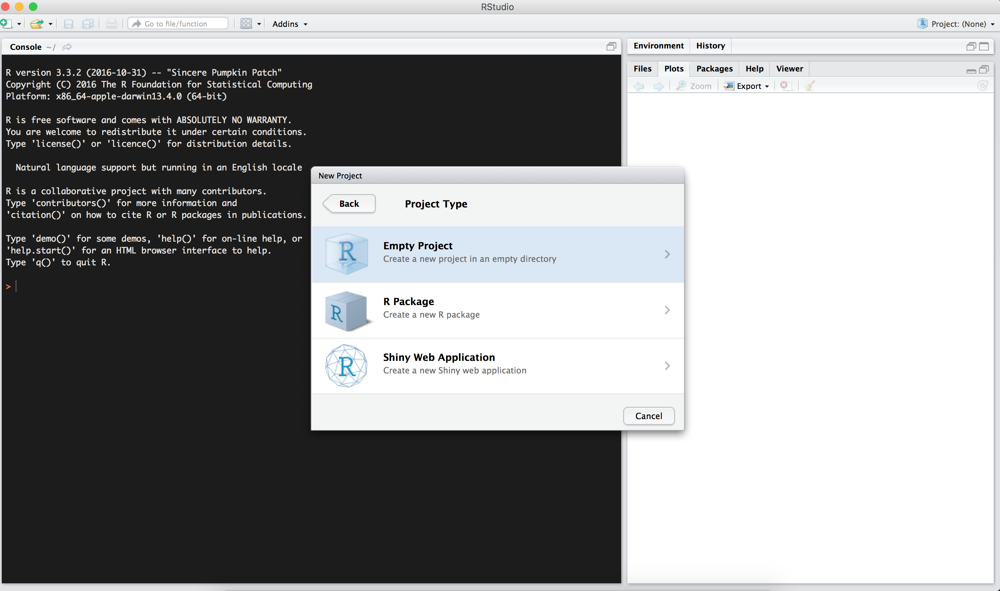

```{r,message=FALSE,echo=FALSE}
  library("knitcitations")
  library("knitr")
  cite_options(citation_format = "pandoc", max.names = 3, style = "html", hyperlink = "to.doc")
  bib <- read.bibtex("bibtexlib.bib")
  opts_chunk$set(tidy = FALSE)
```
---
title: "Introduction to R"
---

This appendix introduces basic use of the [R](http://www.r-project.org)
statistical and computer language and the [RStudio
Desktop](http://www.rstudio.com/ide/) integrated development environment (IDE).
We assume you installed the needed resources mentioned in chapter 2 on getting
ready to use R.

**Warning:** To install R and RStudio you might need administrator privileges. Contact your IT manager and ask for an R installation or administrator privileges.

After installing both R and RStudio, please proceed to open RStudio. RStudio
should look something like:


The top left panel is a text-box where you can write a script. The bottom left
panel is the console (or command line) where you directly execute commands and R
writes results to the console; for example, type in `x <- 1` hit return and then
type `x` and hit return again and watch the console:

> Note: the ">" symbol is R's prompt for you to type something in the console.

```{r, prompt = TRUE, comment = NA}
x <- 1
x
```

You just assigned the value 1 to the variable `x` with the assignment operator
`<-`. The second command asks R to show the value assigned to R. Finally, the
top right panel shows variables loaded into the environment and the bottom right
panel is useful for loading files, plotting graphs, installing packages and
getting help. Feel free to explore all the various tabs or elements of each
panel.

Assignment, data types and operations
---

Let's learn a few simple facts about R:

R uses # to add comments to code:

```{r, prompt = TRUE, comment = NA}
# Add 1 + 1 and write to console
1 + 1
```

This is very useful when developing reusable code or when you want to remember a
few months later what you actually did.

R is case sensitive so that `x <- 5` is not the same as  `X <- x + 1`. Try
typing this into your console and look at `x` and `X`, respectively:

```{r, prompt = TRUE, comment = NA}
x <- 5
X <- x + 1
x
X
```

Next, let's assign numbers to a vector:

```{r, prompt = TRUE, comment = NA}
x <- c(1, 2, 3, 4, 5)
x
```

You can see several important traits of R. The `c()` command (which stands for
combine) can be used to make a list (e.g., a vector) of data. We can overwrite
the variable `x` with new content and we can assign another data type (e.g., a
single number becomes a vector). To compound things further you can even change
the data type to strings overwriting the previous content:

```{r, prompt = TRUE, comment = NA}
a <- c("Paris", "Tokyo", "Seattle")
a
```
Note that we use quotes to denote the string data type containing text. 

To access individual elements of a vector, in this case the second element, we
execute:

```{r, prompt = TRUE, comment = NA}
a[2]
```

Creating RStudio projects 
---

Coding projects usually results in a vast number of files, datasets, scripts and figures that can be difficult to manage and keep organized.
RStudio has created the **RStudio projects** to facilitate and simplify the management a project by associating all of the project files into a working directory of your preference.
This means that all script files, datasets and results of a project can be stored in a set location to facilitate access and management.

To create and RStudio project, we need to go to the upper right corner of RStudio, and click on **New Project**:


A pop-up window should appear. 
We want to create a new directory in our desktop to store our data and keep our files. 
To create the directory click on **New Directory**:


Since we are starting this project from scratch, we will select the **Empty Project** option. This will create a new RStudio project:



Then, we will use *APS_Workshop* as the name for our new directory, and we will create the directory as a subdirectory of your desktop:


And there is your new RStudio project withing the `APS_Workshop` directory! We can start downloading the required files and scripts for the workshop into that folder.

Console tricks: Code completion & command history
---

RStudio has a very useful feature called code completion using the
<kbd>Tab</kbd> key which can complete the full name of an object. For example
type `hel` and hit <kbd>Tab</kbd> and you will see several functions pop up and
you can select `help()`.

This also works inside a function to find function arguments. Type `help(` and
hit <kbd>Tab</kbd> to select arguments for the help function.

RStudio records your command history. Thus you can scroll up or down the
history of executed commands using the *Up* or *Down* arrows. Make sure your
cursor is in the console and try to re-execute previous commands.

To quit R you can either use the <kbd>RStudio > Quit</kbd> pull-down menu
command or execute <kbd>⌘ + Q</kbd> (OS X) or <kbd>ctrl + Q</kbd> (PC).

Getting help
---

One way that R shines above other languages for analysis is the fact that
R packages in CRAN are all documented. Help files are written in HTML and give
the user a brief overview of:

 - The purpose of a function
 - The parameters it takes
 - The output it yields
 - Some examples demonstrating its usage. 

To see all of the help topics in a package, you can simply type:

```{r, eval = FALSE}
help(package = "poppr") # Get help for a package.
help(amova)             # Get help for the amova function.
?amova                  # same as above.
??multilocus            # Search for functions that have the keyword multilocus.
```
Some packages include vignettes that can have different formats such as being
introductions, tutorials, or reference cards in PDF format. You can look at a
list of vignettes in all packages by typing:

```{r, eval=FALSE}
browseVignettes()                  # see vignettes from all packages
browseVignettes(package = 'poppr') # see vignettes from a specific package.
```

and to look at a specific vignette you can type:

```{r, eval=FALSE}
vignette('poppr_manual')
```

Useful resources to learn R
---

*Introductory*

 - [Swirl](http://swirlstats.com/) is a very well thought out R package that teaches you interactively.
 - [Code School Try R](https://www.codeschool.com/courses/try-r) is a nice interactive tutorial. 
 - [Quick R](http://www.statmethods.net/interface/help.html)
 - [R reference card](http://cran.r-project.org/doc/contrib/Short-refcard.pdf)
 - A very nice, short [introduction to R](http://ateucher.github.io/rcourse_site/index.html)

*Advanced*

 - [Advanced R](http://adv-r.had.co.nz/) by Hadley Wickham

*Books*:

 - [R in a Nutshell](http://shop.oreilly.com/product/0636920022008.do) 
 - [R cookbook](http://www.cookbook-r.com/) is a nice quick reference and tutorial for general R use.
 - [ggplot2 book](http://ggplot2.org/book/) is a useful reference if you want to customize graphs for publication. 

